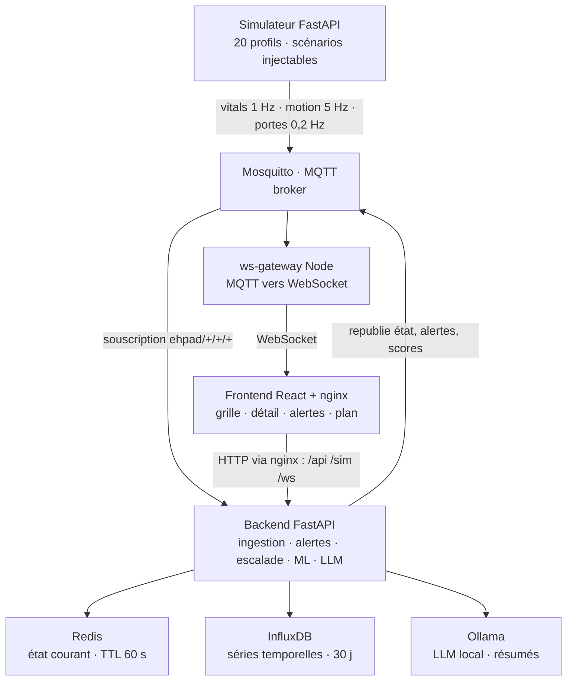

# Monitoring EHPAD — architecture et écarts

État des lieux du **Projet 2 — IoT Santé** : plateforme de surveillance temps réel de 20 résidents
en EHPAD. Capteurs simulés, ingestion MQTT, scoring ML, alertes à cinq niveaux avec auto-escalade,
détection de fugue, résumé quotidien par LLM local.

Ce document donne l'architecture telle qu'elle est aujourd'hui, puis liste et cote ce qui manque
pour en faire un produit utilisable dans un établissement.

> 9 services Docker · ~4 700 lignes · 59 tests backend, 0 côté front · 74 commits, avril 2026

**Version mise en page : [`etat-des-lieux.pdf`](etat-des-lieux.pdf)** — 4 pages A4.
Version web : [`etat-des-lieux.html`](etat-des-lieux.html), fichier autonome, à ouvrir dans un navigateur.

---

## 1. Architecture

| Couche | Services |
| --- | --- |
| Capteurs *(simulés)* | Simulateur FastAPI — 20 profils, scénarios chute / cardiaque / fugue / dégradation |
| Bus temps réel | Mosquitto — découple le producteur de données du backend et de l'interface |
| Traitement | Backend FastAPI · ws-gateway Node |
| Persistance | Redis · InfluxDB · Ollama |
| Restitution | Frontend React servi par nginx |

MQTT fait la colonne vertébrale : le backend y republie l'état mergé au lieu de pousser directement
vers l'interface, donc **le simulateur se remplace par de vrais capteurs sans toucher au backend**.
Le navigateur ne parle qu'à nginx, d'où l'absence de configuration CORS dans le code.
Les neuf services démarrent par un unique `docker compose up`.

---

## 2. Écarts avec un produit fini

| | Écart | Criticité | Effort |
| --- | --- | --- | --- |
| **É1** | **Aucun capteur réel.** Toute la donnée vient du simulateur. Aucun pilote BLE ou LoRa, pas d'appairage, pas de gestion de batterie ni de perte de lien. | 🔴 Bloquant | Élevé |
| **É2** | **L'alerte ne sort pas du navigateur.** Un toast dans l'onglet ouvert, rien d'autre. La nuit, personne devant l'écran : il faut du SMS, du push ou le bip de l'établissement. | 🔴 Bloquant | Moyen |
| **É3** | **Aucune authentification.** Toutes les routes sont ouvertes. N'importe qui lit les constantes des 20 résidents et peut acquitter — donc éteindre — une alerte vitale. | 🔴 Bloquant | Moyen |
| **É4** | **MQTT anonyme, aucun TLS.** `allow_anonymous true` et zéro chiffrement. Un faux client peut injecter de fausses constantes. | 🔴 Bloquant | Moyen |
| **É5** | **Résidents et personnel codés en dur.** Déclarés en Python. Admettre un résident ou le changer de chambre demande un redéploiement. | 🔴 Bloquant | Moyen |
| **É6** | **ML entraîné sur nos propres données simulées.** Le modèle apprend le simulateur, pas la physiologie. Aucune mesure de faux positifs, donc rien de démontrable sur la détection. | 🟠 Majeur | Élevé |
| **É7** | **Un seul backend, escalades en mémoire.** S'il redémarre, les escalades en cours disparaissent sans bruit : une alerte non acquittée ne montera jamais. | 🟠 Majeur | Élevé |
| **É8** | **Données éphémères, aucune sauvegarde.** Volumes Docker locaux, rétention Influx de 30 jours. Aucune trace de qui a acquitté quelle alerte. | 🟠 Majeur | Moyen |
| **É9** | **Hébergement non HDS.** Des données de santé nominatives imposent un hébergeur certifié HDS. Chantier d'organisation, pas de code. | 🟠 Majeur | Hors dev |
| **É10** | **Pas de CI, aucun test front.** 59 tests backend solides, mais rien sur React ni sur la chaîne capteur → alerte → écran, et rien ne s'exécute automatiquement. | ⚪ Mineur | Faible |

**Criticité** — 🔴 Bloquant : empêche la mise en service · 🟠 Majeur : exploitation dégradée · ⚪ Mineur : dette acceptable
**Effort** — Faible ≤ 2 j · Moyen 3–8 j · Élevé > 8 j

---

## 3. Ce qu'il faut en retenir

**La chaîne fonctionne de bout en bout** : un capteur publie, l'alerte arrive à l'écran en moins de
deux secondes, l'escalade s'enclenche seule, le ML anticipe une dégradation. Comme démonstrateur,
c'est complet.

**Ce qui manque n'est presque jamais une fonctionnalité.** Ce sont les capteurs physiques, une
identité derrière chaque geste, et une alerte qui franchit les limites du navigateur. Tant que ces
trois-là manquent, un établissement ne peut pas brancher le système.

Dans quel ordre fermer les écarts :

1. **D'abord** — É2 et É3 : faire sortir l'alerte de l'écran, et savoir qui l'acquitte.
2. **Ensuite** — É4, É5, É8 : chiffrement, référentiels en base, sauvegardes.
3. **Enfin** — É1 et É6 : vrais capteurs et validation du modèle, les deux gros chantiers.

---

Projet 2 — IoT Santé · Titouan Brunet, Cedric Usannaz et Fares Mansour · dépôt au 30 avril 2026
