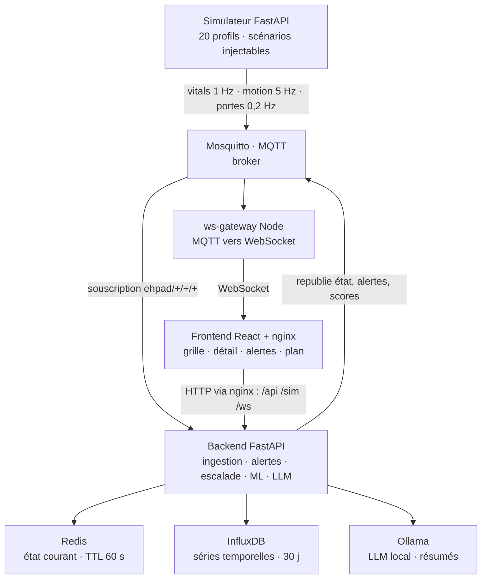

# Monitoring EHPAD — architecture et écarts

État des lieux du **Projet 2 — IoT Santé** : plateforme de surveillance temps réel de 20 résidents
en EHPAD. Capteurs simulés, ingestion MQTT, scoring ML, alertes à cinq niveaux avec auto-escalade,
détection de fugue, résumé quotidien par LLM local.

Ce document donne l'architecture telle qu'elle est aujourd'hui, puis liste et cote ce qui manque
pour en faire un produit utilisable dans un établissement.

> 9 services Docker · ~4 700 lignes · 59 tests backend, 0 côté front · 74 commits, avril 2026

**Code du projet analysé : [Usannazcedric/projet-2-iot-sante](https://github.com/Usannazcedric/projet-2-iot-sante)**

**Version mise en page : [`etat-des-lieux.pdf`](etat-des-lieux.pdf)** — 4 pages A4.
Version web : [`etat-des-lieux.html`](etat-des-lieux.html), fichier autonome, à ouvrir dans un navigateur.

---

## 1. Architecture

| Couche | Services |
| --- | --- |
| Capteurs *(simulés)* | Simulateur FastAPI — 20 profils, scénarios chute / cardiaque / fugue / dégradation |
| Bus temps réel | Mosquitto — découple le producteur de données du backend et de l'interface |
| Traitement | Backend FastAPI · ws-gateway Node |
| Persistance | Redis · InfluxDB · Ollama |
| Restitution | Frontend React servi par nginx |

MQTT fait la colonne vertébrale : le backend y republie l'état mergé au lieu de pousser directement
vers l'interface, donc **le simulateur se remplace par de vrais capteurs sans toucher au backend**.
Le navigateur ne parle qu'à nginx, d'où l'absence de configuration CORS dans le code.
Les neuf services démarrent par un unique `docker compose up`.

---

## 2. Écarts techniques

Chaque ligne porte la dimension de la grille qu'elle couvre.

| | Dimension | Écart | Criticité | Effort |
| --- | --- | --- | --- | --- |
| **T1** | Données & capteur | **Aucun capteur réel.** Toute la mesure est tirée d'une loi normale par le simulateur. Pas de pilote BLE ou LoRa, pas d'appairage, pas de gestion de batterie ni de perte de lien, et aucun traitement des artefacts de mesure — bracelet retiré, brassard mal posé, résident qui bouge. | 🔴 Bloquant | Élevé |
| **T2** | Diffusion | **L'alerte ne sort pas du navigateur.** Un toast dans l'onglet ouvert, rien d'autre. La nuit, personne devant l'écran : il faut du SMS, du push ou le bip de l'établissement. | 🔴 Bloquant | Moyen |
| **T3** | Identité | **Aucune authentification.** Toutes les routes sont ouvertes. N'importe qui lit les constantes des 20 résidents et peut acquitter — donc éteindre — une alerte vitale. | 🔴 Bloquant | Moyen |
| **T4** | Sécurité device | **MQTT anonyme, secrets en clair, pas de mise à jour.** `allow_anonymous true` et zéro TLS : un faux client peut injecter de fausses constantes. Le jeton InfluxDB est écrit en clair dans `docker-compose.yml`, et aucun mécanisme de mise à jour à distance (OTA) n'est prévu pour un parc de capteurs. | 🔴 Bloquant | Moyen |
| **T5** | Référentiels | **Résidents et personnel codés en dur.** Déclarés en Python. Admettre un résident ou le changer de chambre demande un redéploiement. | 🔴 Bloquant | Moyen |
| **T6** | IA | **Modèle entraîné sur nos propres données simulées.** L'IsolationForest apprend le simulateur, pas la physiologie. Aucun jeu de données réel, aucune mesure de faux positifs. | 🟠 Majeur | Élevé |
| **T7** | Disponibilité | **Un seul backend, escalades en mémoire.** S'il redémarre, les escalades en cours disparaissent sans bruit : une alerte non acquittée ne montera jamais. La panne est silencieuse, c'est le pire des cas. | 🟠 Majeur | Élevé |
| **T8** | Données | **Données éphémères, aucune sauvegarde.** Volumes Docker locaux, rétention Influx de 30 jours. Aucune trace horodatée de qui a acquitté quelle alerte — rien d'opposable en cas de litige. | 🟠 Majeur | Moyen |
| **T9** | Interopérabilité | **Aucun lien avec le système d'information de l'établissement.** Ni FHIR, ni HL7, aucune route d'export. Les données restent prisonnières de la plateforme et ne remontent pas au dossier de soin : le soignant ressaisit à la main. | 🟠 Majeur | Moyen |
| **T10** | Qualité | **Pas de CI, aucun test front.** 59 tests backend solides, mais rien sur React ni sur la chaîne complète capteur → alerte → écran, et rien ne s'exécute automatiquement. | ⚪ Mineur | Faible |

---

## 3. Écarts produit et réglementaires

Ceux qu'aucun sprint de développement ne ferme : ils se traitent en amont du code.

| | Dimension | Écart | Criticité | Effort |
| --- | --- | --- | --- | --- |
| **R1** | Statut | **Le produit n'est jamais qualifié.** Bien-être ou dispositif médical ? Il calcule un score de risque et déclenche une alerte de soin : très probablement un DM au sens du règlement 2017/745, donc marquage CE, dossier technique et organisme notifié. La question n'a pas été instruite. | 🔴 Bloquant | Hors dev |
| **R2** | Risques | **Aucune analyse de risques.** « Que se passe-t-il si l'alerte ne part pas ? » n'a pas de réponse écrite, alors que c'est exactement le mode de défaillance qui blesse. Ni AMDEC, ni ISO 14971, ni conduite à tenir en cas de panne. | 🔴 Bloquant | Moyen |
| **R3** | Données personnelles | **Ni hébergement HDS, ni AIPD, ni consentement.** Des données de santé nominatives imposent les trois. Aucun n'existe : le système tourne sur des volumes Docker locaux, sans analyse d'impact ni recueil du consentement des résidents ou de leurs tuteurs. | 🔴 Bloquant | Hors dev |
| **R4** | Validation | **Performance jamais prouvée contre une référence.** Ni sensibilité, ni spécificité, ni taux de fausses alertes par nuit. Impossible d'affirmer que le système détecte mieux qu'une ronde — or c'est la seule promesse qui justifie de l'acheter. | 🟠 Majeur | Élevé |
| **R5** | Usage | **Jamais testé avec de vrais soignants ni résidents.** Zéro essai terrain. On ignore si cinq niveaux d'alerte restent tenables une nuit à deux aides-soignantes, et si le tableau de bord est lisible dans le couloir plutôt qu'au bureau. | 🟠 Majeur | Moyen |
| **R6** | Modèle économique | **Qui paie n'a pas été abordé.** L'établissement, l'ARS, la famille ? La réponse décide du périmètre à construire : un forfait par lit et un abonnement par résident ne donnent pas le même produit. | ⚪ Mineur | Hors dev |

**Criticité** — 🔴 Bloquant : empêche la mise en service · 🟠 Majeur : exploitation dégradée · ⚪ Mineur : dette acceptable
**Effort** — Faible ≤ 2 j · Moyen 3–8 j · Élevé > 8 j · Hors dev = ni code ni sprint

---

## 4. Ce qu'il faut en retenir

**La chaîne fonctionne de bout en bout** : un capteur publie, l'alerte arrive à l'écran en moins de
deux secondes, l'escalade s'enclenche seule, le ML anticipe une dégradation. Comme démonstrateur,
c'est complet.

**Ce qui manque n'est presque jamais une fonctionnalité.** Ce sont les capteurs physiques, une
identité derrière chaque geste, et une alerte qui franchit les limites du navigateur. Tant que ces
trois-là manquent, un établissement ne peut pas brancher le système.

**Et la moitié du chemin restant ne s'écrit pas en code.** Qualifier le produit, analyser les
risques, encadrer les données personnelles, mesurer la détection contre une référence, essayer le
tout avec de vrais soignants : six écarts sur seize se jouent avant le premier commit. C'est là que
se trouve la vraie distance avec un produit fini.

Dans quel ordre fermer les écarts :

1. **D'abord** — T2, T3 et R2 : faire sortir l'alerte de l'écran, savoir qui l'acquitte, et écrire
   noir sur blanc ce qui se passe quand elle ne part pas.
2. **Ensuite** — T4, T5, T8 et R3 : chiffrement, référentiels en base, sauvegardes, et le cadre
   RGPD-HDS sans lequel aucune donnée réelle ne peut entrer.
3. **Enfin** — T1, T6, R1 et R4 : vrais capteurs, validation du modèle contre une référence,
   qualification réglementaire. Les gros chantiers, et ils vont ensemble.

---

Projet 2 — IoT Santé · Titouan Brunet, Cedric Usannaz et Fares Mansour · dépôt au 30 avril 2026
