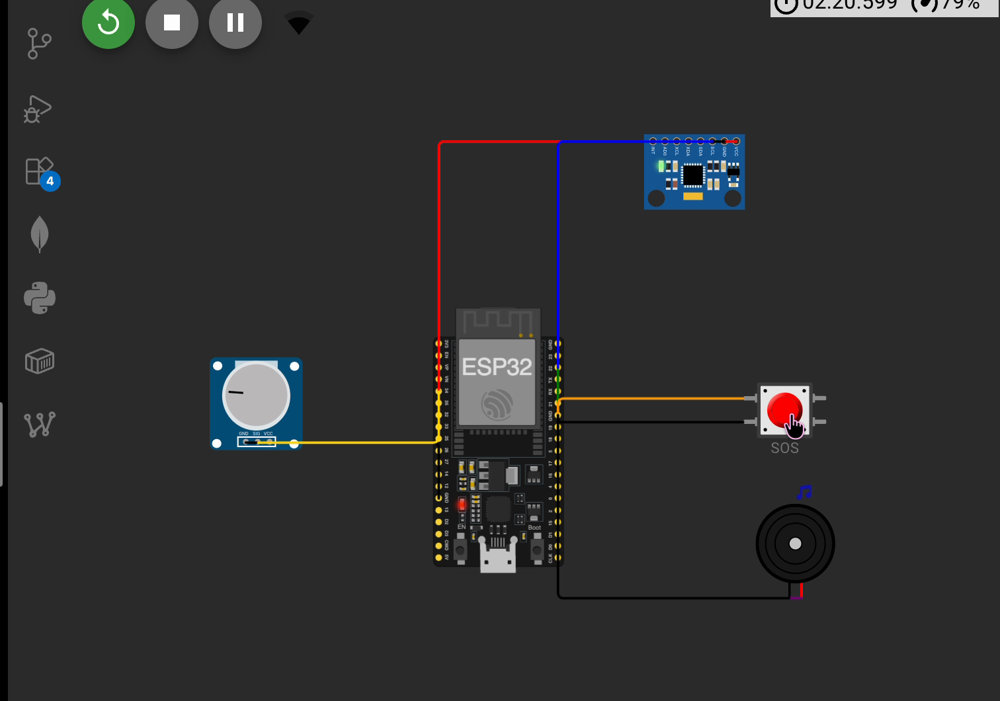
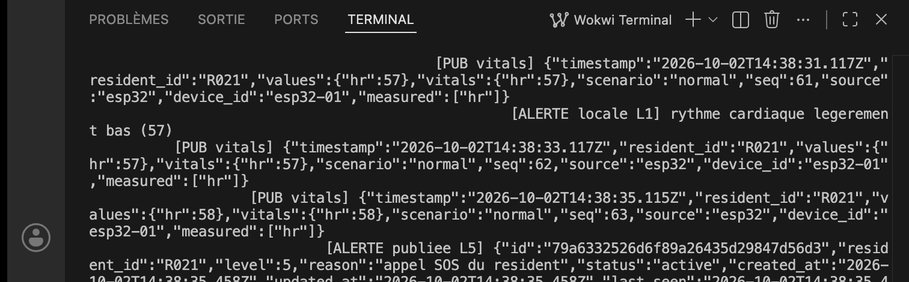
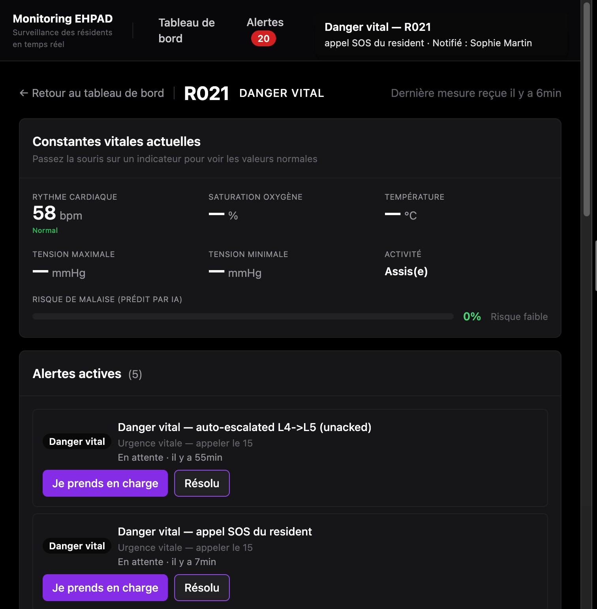

# Module 1 — Du simulateur Python au firmware ESP32 (Wokwi)

TP Digi5 · équipe EHPAD · dépôt [`monitoring-ehpad`](../..)

Ce dossier remplace le **simulateur Python** du projet Digi4 par un **firmware ESP32**
qui publie sur MQTT exactement les mêmes topics et les mêmes clés JSON. Le backend et
le dashboard du projet n'ont pas une ligne à changer.

Le contrat complet (topics, formats, seuils, validation Pydantic) est dans
[`../../docs/contrat_mqtt.md`](../../docs/contrat_mqtt.md).

---

## Lien du projet Wokwi

> **→ `COLLER ICI LE LIEN wokwi.com DU PROJET`**

Dans Wokwi : **Save**, puis **Share** → copier l'URL publique.
Le projet doit rester accessible sans compte.

---

## Fichiers

| Fichier | Rôle |
| --- | --- |
| [`diagram.json`](diagram.json) | Le montage : ESP32 + MPU-6050 + bouton SOS + buzzer + potentiomètre |
| [`libraries.txt`](libraries.txt) | Une seule dépendance : `PubSubClient` |
| [`sketch.ino`](sketch.ino) | Le firmware |

---

## Le montage

| Composant | Broche ESP32 | Rôle |
| --- | --- | --- |
| MPU-6050 `SDA` / `SCL` | 21 / 22 | Accéléromètre I2C, adresse `0x68` |
| Bouton poussoir (rouge) | 18 → GND | Appel SOS, pull-up interne |
| Buzzer | 19 | Alarme locale, niveau ≥ 4 |
| Potentiomètre `SIG` | 34 | Tient lieu de capteur de fréquence cardiaque |

Le potentiomètre est branché sur **GPIO 34 (ADC1)** : l'ADC2 de l'ESP32 est inutilisable
dès que le Wi-Fi est actif. Le MPU-6050 et le potentiomètre sont alimentés en **3V3**,
jamais en 5 V.

---

## Lancer le projet dans Wokwi

1. [wokwi.com](https://wokwi.com) → *New Project* → **ESP32**.
2. Onglet `diagram.json` : remplacer tout le contenu par celui de [`diagram.json`](diagram.json).
3. Onglet `libraries.txt` (le créer s'il n'existe pas) : coller [`libraries.txt`](libraries.txt).
4. Onglet `sketch.ino` : coller [`sketch.ino`](sketch.ino).
5. ▶ *Start the simulation*. Le moniteur série (115200 bauds) doit afficher :

```
MPU-6050 detecte (0x68)
Topics :
  vitals : digi5/equipe-ehpad/ehpad/vitals/resident/R021
  ...
Wi-Fi OK, IP = 10.13.37.2
NTP : synchronisation... OK
MQTT : connexion a broker.hivemq.com:1883 ... OK
[PUB vitals] {"timestamp":"...","resident_id":"R021","values":{"hr":78},...}
```

puis une ligne `PUB vitals` toutes les 2 secondes. Tourner le potentiomètre fait bouger
`hr` ; l'appui sur le bouton rouge écrit `[ALERTE publiee L5]` et déclenche le buzzer.

Au besoin, changer `TEAM_ID` en haut de `sketch.ino` : c'est la **seule** valeur à adapter.

---

## Ce que le firmware publie

Préfixe : `digi5/<TEAM_ID>/ehpad` — `broker.hivemq.com` est un broker public partagé par
toute la promo, un topic `ehpad/...` nu entrerait en collision avec celui d'une autre équipe.

Un **pont Mosquitto** (`mosquitto/config/mosquitto.conf`) rapatrie ces topics sur le broker
local en leur rendant leur nom Digi4, de sorte que le backend, le moteur d'alertes, le ML
et le dashboard voient la carte exactement comme ils voient le simulateur. Le pont est
unidirectionnel : rien ne repart vers le broker public. Détails dans
[`../../docs/contrat_mqtt.md`](../../docs/contrat_mqtt.md) §6.

| Topic | Fréquence | Contenu |
| --- | --- | --- |
| `…/vitals/resident/R021` | 0,5 Hz | `hr` lue sur le potentiomètre |
| `…/motion/resident/R021` | 0,5 Hz | `ax`, `ay`, `az` (en m/s²), `activity` |
| `…/alerts/new` | appui SOS | Alerte au format `Alert` du backend, niveau 5 |
| `…/device/esp32-01/status` | connexion / perte | `online` (retenu) / `offline` (Last Will) |

La carte alimente **R021**, volontairement hors de la plage du simulateur Python
(R001 à R020) : les deux sources ne peuvent donc pas se contredire sur un même résident.
Le profil est déclaré dans `backend/app/profiles.py`, chambre 121.

Exemple de message `vitals` :

```json
{
  "timestamp": "2026-10-02T14:21:07.413Z",
  "resident_id": "R021",
  "values": { "hr": 78 },
  "vitals": { "hr": 78 },
  "scenario": "normal",
  "seq": 42,
  "source": "esp32",
  "device_id": "esp32-01",
  "measured": ["hr"]
}
```

`values` ne porte **que ce que la carte mesure réellement**. SpO2, tension et température
sont absentes, pas inventées ; `measured` les liste explicitement pour qu'une valeur
manquante ne se lise pas comme une valeur normale. La contrepartie à prévoir côté backend
est écrite dans le contrat MQTT (§4).

### Seuils d'alerte

Repris à l'identique de `backend/app/alerts/rules.py`, pour que l'alerte du device et
celle du backend ne puissent pas se contredire :

| Déclencheur | Niveau | Buzzer | Publié sur MQTT |
| --- | --- | --- | --- |
| `hr < 40` ou `hr > 140` | 4 — URGENCE | oui | non |
| `hr > 100` | 2 — ATTENTION | non | non |
| `50 ≤ hr < 58` | 1 — INFORMATION | non | non |
| Norme d'accélération > 2,5 g | 4 — URGENCE | oui | non |
| Bouton SOS | 5 — DANGER VITAL | oui | **oui** |

Pourquoi la carte ne publie que le SOS : le backend reçoit déjà les `vitals` et le
`motion`, et les évalue avec **exactement les mêmes seuils**. Republier depuis le device
ferait apparaître chaque alerte **deux fois** dans le dashboard. Le SOS, lui, n'existe
nulle part dans `rules.py` : aucune mesure ne le trahit, le device est le seul à pouvoir
le signaler. L'évaluation embarquée reste entière pour ce qu'elle sert vraiment ici —
réagir sans réseau, tout de suite, avec le buzzer.

Une alerte n'est émise que lorsque le **niveau change** : la réémettre toutes les 2 s
rendrait le journal illisible. Le buzzer sonne 3 s dès le niveau 4.

Les niveaux 5 et 3 du backend exigent la SpO2 (`spo2 < 85`, `spo2 < 93`), que cette carte
ne mesure pas : ils restent inatteignables depuis le device, hors bouton SOS.

---

## Vérifier que la chaîne fonctionne

Sans rien installer : les deux commandes ci-dessous lisent le flux là où il passe.
La stack doit tourner (`docker compose up -d` à la racine).

Ce que la carte envoie au broker public :

```bash
docker exec ehpad-mosquitto mosquitto_sub -h broker.hivemq.com \
  -t 'digi5/equipe-ehpad/ehpad/#' -v
```

Ce que le pont dépose sur le broker local, sous son nom Digi4 :

```bash
docker exec ehpad-mosquitto mosquitto_sub -h localhost \
  -t 'ehpad/vitals/resident/R021' -v
```

Et ce que le backend en a fait — les constantes non mesurées doivent valoir `null`,
jamais `0` :

```bash
curl -s http://localhost:8000/residents/R021 | python3 -m json.tool
```

---

## Captures

Enregistrer les fichiers dans `docs/` sous ces noms exacts : les liens ci-dessous
les affichent dès qu'ils existent.

| Capture | Fichier |
| --- | --- |
| Montage Wokwi en cours de simulation | `docs/wokwi-simulation.png` |
| Moniteur série (lignes `PUB vitals`) | `docs/serial-monitor.png` |
| Dashboard affichant R021 | `docs/dashboard.png` |





---

## Hygiène

- Données **fictives**, usage pédagogique. `broker.hivemq.com` est public : n'y publier
  aucune donnée réelle, et aucune finalité diagnostique.
- Aucun mot de passe réel n'est présent dans ces fichiers. Le bloc TLS (`USE_TLS 1`)
  ne contient que des placeholders ; les identifiants HiveMQ Cloud ne doivent jamais
  être commités.
- `RESIDENT_ID` doit respecter `^R\d{3}$` : le backend rejette tout autre format
  (`backend/app/models.py`). En changer la valeur impose de déclarer le profil
  correspondant dans `backend/app/profiles.py`.
